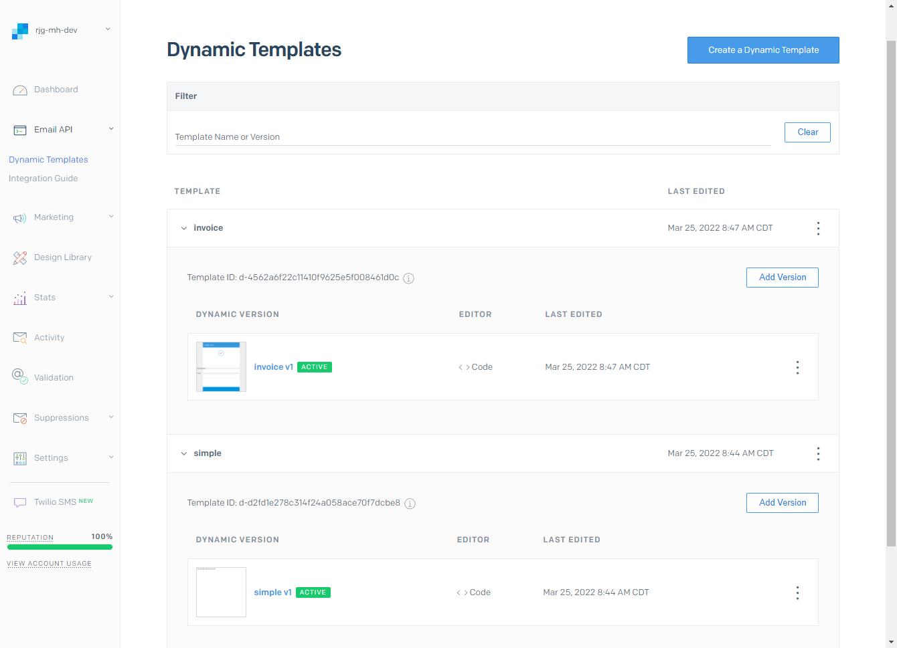
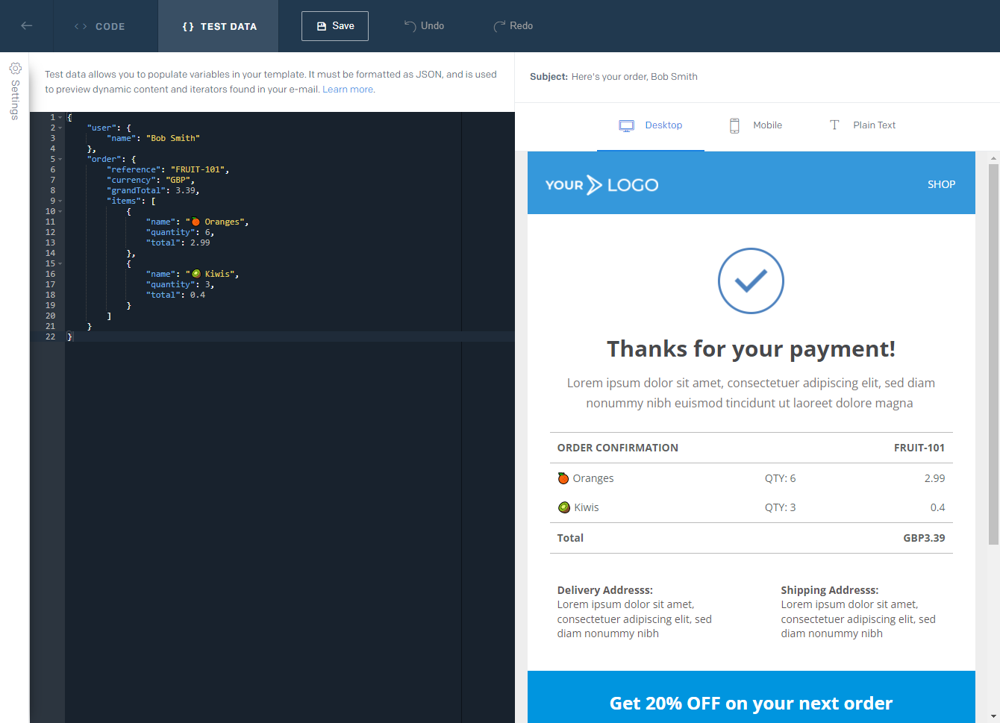

# Skills Lab: SendGrid v3 API

In this skills lab I am exploring:
* SendGrid v3 email send API
* Transactional templates with template versions
* Dynamic template data for multiple recipients

## 🚧👷‍♂️ Build & Run

To run this project:
1. Ensure you have obtained a SendGrid API key with the following permissions
   * Mail Send
   * Template Designer
1. Create a `appsettings.Development.json` file, next to `appsettings.json`
1. Specify values for your local app settings:
    ```json
    {
        "SendGrid": {
            "ApiKey": "your api key here",
            "SandboxModeEnabled": false
        },
        "Template": "" // One of "Simple" | "Invoice"
    }
    ```
1. Specify `"SandboxModeEnabled": false` if you wish SendGrid to perform the send,    
otherwise `true` means SendGrid will validate the mail message only
1. Specify `"Template": "Invoice"` to see example of complex template with substitution of iteration data   
    otherwise `"Simple"` for basic substitution
1. Run the application

## ✅ Output

The app starts by uploading both templates into the `Email API > Dynamic Templates` area of the portal, with sample data to assist with previewing: 





Secondly, the app will construct a mail message with some sample recipients to demonstrate sending the configured template, with dynamic template data, to multiple recipients.

Example serialised mail message:
```json
{
    "from": {
        "email": "no-reply@***.com"
    },
    "personalizations": [
        {
            "to": [
                {
                    "name": "Bob Smith",
                    "email": "bob.smith@***.com"
                }
            ],
            "custom_args": {
                "tenant_id": "11",
                "recipient_id": "25",
                "run_id": "6"
            },
            "dynamic_template_data": {
                "user": {
                    "name": "Bob",
                    "phone": "123456"
                },
                "order": {
                    "reference": "FRUIT-101",
                    "currency": "GBP",
                    "grandTotal": 13.25,
                    "items": [
                        {
                            "name": "🍎 Apples",
                            "quantity": 6,
                            "total": 12
                        },
                        {
                            "name": "🍌 Bananas",
                            "quantity": 3,
                            "total": 1.25
                        }
                    ]
                }
            }
        },
        {
            "to": [
                {
                    "name": "Alice Smith",
                    "email": "alice.smith@***.com"
                }
            ],
            "custom_args": {
                "tenant_id": "11",
                "recipient_id": "33",
                "run_id": "6"
            },
            "dynamic_template_data": {
                "user": {
                    "name": "Alice",
                    "phone": "123456"
                },
                "order": {
                    "reference": "FRUIT-999",
                    "currency": "GBP",
                    "grandTotal": 3.39,
                    "items": [
                        {
                            "name": "🍊 Oranges",
                            "quantity": 6,
                            "total": 2.99
                        },
                        {
                            "name": "🥝 Kiwis",
                            "quantity": 3,
                            "total": 0.4
                        }
                    ]
                }
            }
        }
    ],
    "template_id": "d-4562a6f22c11410f9625e5f008461d0c",
    "mail_settings": {
        "sandbox_mode": {
            "enable": true
        }
    }
}
```